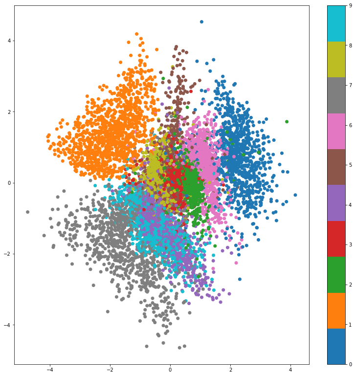
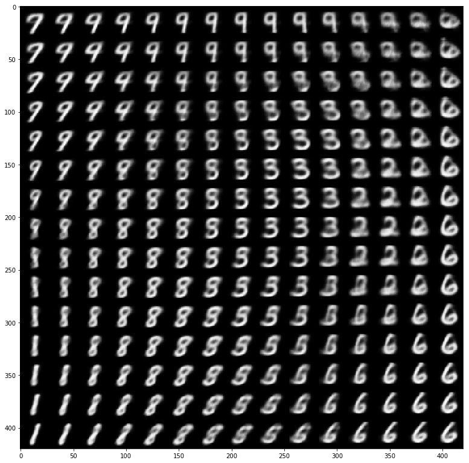
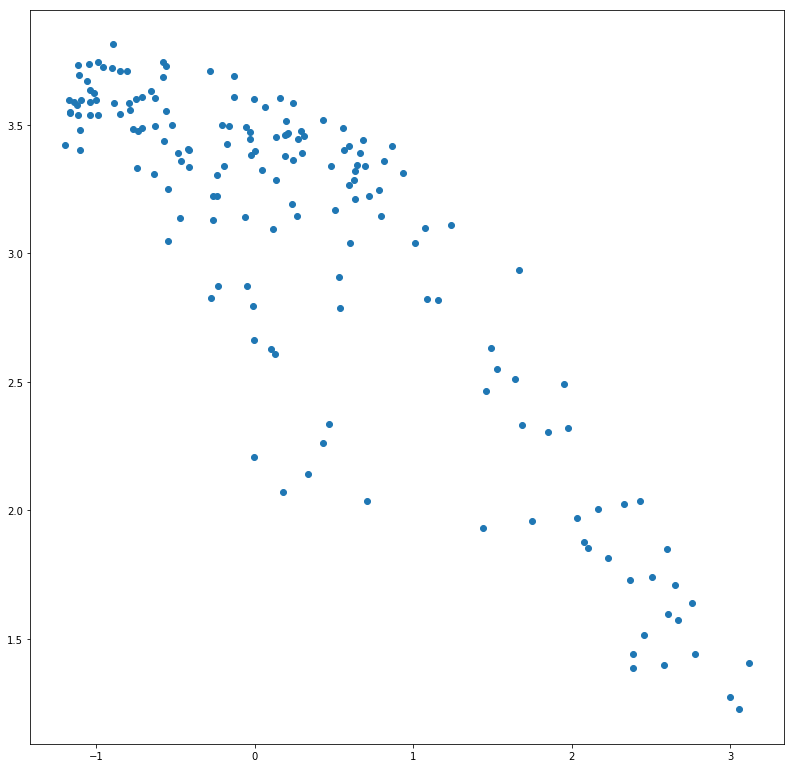
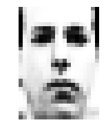

<h1><center>Variational Autoencoder</center></h1>
This is my implementation of Kingma's variational autoencoder. I tried to be as flexible with the implementation as I could, so different distribution could be used for:
1. The approximate posterior - *encoder* - $q\_{\phi}\left(z|x\right)$
2. The conditional likelihood of the data - *decoder* - $p\_{\theta}\left(x|z\right)$
3. The prior on the latent space $p\left(z\right)$. Note that this implementation doesn't support a parametrized prior [yet ;)]

This Notebook relies on `Keras` and `ipywidgets` packages.

## Notebook Setup
first we setup our notebook so we can view the visualizations inlined


```python
import matplotlib.pyplot as plt

# configure matplotlib
%matplotlib inline
plt.rcParams['figure.figsize'] = (13.5, 13.5) # set default size of plots
plt.rcParams['image.interpolation'] = 'nearest'

%load_ext autoreload
%autoreload 2
```

## Framework Definition
Now we define our VAE model as an abstract class. In order to instantiate a VAE we will only need to implement the abstarct methods, and we are done!

### Custom Layers
First, we define a couple of custom layers we need for the model


```python
import abc
import numpy as np

from keras.models import Model, Input
from keras.layers import Dense, Reshape, Flatten, Lambda, Layer
import keras.backend as K


def to_list(obj):
    return obj if isinstance(obj, list) else [obj]


class LatentSampling(Layer):
    '''Custom layer used to sample in the latent space and add the kld loss to the objective
    '''
    def __init__(self, output_dim, sampling_func, kld_func, **kwargs):
        self.output_dim = output_dim
        self.sample = sampling_func
        self.kld = kld_func
        super(LatentSampling, self).__init__(**kwargs)

    def call(self, inputs):
        eps, posterior_params = inputs[0], inputs[1:]
        z = self.sample(eps, *posterior_params)
        kld_loss = self.kld(z, *posterior_params)
        # Add the KL divergence loss of this batch to the objective
        self.add_loss(K.mean(kld_loss), inputs=inputs)
        return z

    def compute_output_shape(self, input_shape):
        return (input_shape[0], self.output_dim)
    
class DataSampling(Layer):
    '''Custom layer used to sample in the data space and add the reconstruction loss to the objective
    '''
    def __init__(self, output_dim, sampling_func, reconstruction_loss_func, **kwargs):
        self.output_dim = output_dim
        self.sample = sampling_func
        self.reconstruction_loss = reconstruction_loss_func
        super(DataSampling, self).__init__(**kwargs)

    def call(self, inputs):
        x, likelihood_params = inputs[0], inputs[1:]
        x_reconstructed = self.sample(*likelihood_params)
        reconstruction_loss = self.reconstruction_loss(x, *likelihood_params)
        # Add the reconstruction loss for this batch to the objective
        self.add_loss(K.mean(reconstruction_loss), inputs=inputs)
        return x_reconstructed

    def compute_output_shape(self, input_shape):
        return (input_shape[0], self.output_dim)

```

    Using Theano backend.
    WARNING (theano.sandbox.cuda): The cuda backend is deprecated and will be removed in the next release (v0.10).  Please switch to the gpuarray backend. You can get more information about how to switch at this URL:
     https://github.com/Theano/Theano/wiki/Converting-to-the-new-gpu-back-end%28gpuarray%29
    
    Using gpu device 0: TITAN X (Pascal) (CNMeM is enabled with initial size: 95.0% of memory, cuDNN 5110)


### Abstract Variational Autoencoder
Then, we define our main class


```python
class AbstractVariationalAutoencoder(abc.ABC):   
    def __init__(self, data_shape, latent_dim):
        self.data_shape = data_shape
        self.latent_dim = latent_dim
        self._encoder = self._create_encoder()  # Outputs posterior parameters
        self._decoder = self._create_decoder()  # Outputs to conditional likelihood parameters
        models = self._create_vae()
        self._vae = models[0]
        self._encoder_to_latent_space = models[1]
        self._decoder_to_data_space = models[2]
        
        
    ####################
    # Abstract Methods #
    ####################
    @abc.abstractmethod
    def _create_encoder(self):
        '''Create and return an encoder keras model with data as input, and the posterior parameters as output(s)'''
        raise NotImplementedError()
    
    @abc.abstractmethod
    def _create_decoder(self):
        '''Create and return a decoder keras model with latent vector as input,
        and the conditional likelihood parameters as output(s)'''
        raise NotImplementedError()
        
    @abc.abstractmethod
    def _sample_eps(self, eps_shape):
        '''Return a sample from the eplison distribution (input noise)'''
        raise NotImplementedError()

    @abc.abstractmethod
    def _sample_latent_z(self, eps, *posterior_params):
        '''Return a sample with `eps` noise as input and according to the posterior parameters'''
        raise NotImplementedError()

    @abc.abstractmethod
    def _kl_divergence(self, z, *posterior_params):
        '''Compute the KL divergence from the latent prior to the approximate posterior'''
        raise NotImplementedError()
    
    @abc.abstractmethod
    def _sample_data(self, *likelihood_params):
        '''return a sample according to the likelihood parameters'''
        raise NotImplementedError()
        
    @abc.abstractmethod
    def _negative_expected_log_likelihood(self, x, *likelihood_params):
        '''Compute the negative expected log likelihood (a.k.a reconstruction loss) from the likelihood parameters'''
        raise NotImplementedError()
        
    #####################################################    
    
    def _create_vae(self):
        # Encoder
        data_input = Input(shape=self.data_shape, name='data')
        posterior_params = self.encoder(data_input)
        
        # Sampling
        noise_input = Input(shape=(self.latent_dim,), name='noise')
        posterior_params = to_list(posterior_params)
        latent_sample = LatentSampling(self.latent_dim, 
                                       self._sample_latent_z, self._kl_divergence)([noise_input] + posterior_params)
        
        # Decoder
        likelihood_params = self.decoder(latent_sample)
        likelihood_params = to_list(likelihood_params)
        reconstructed_x = DataSampling(self.data_shape, 
                                       self._sample_data, 
                                       self._negative_expected_log_likelihood)([data_input] + likelihood_params)
        
        # Create models
        vae = Model([data_input, noise_input], reconstructed_x)
        
        encoder_params = to_list(self.encoder(data_input))
        encoded_z = Lambda(lambda params: self._sample_latent_z(*params), 
                           output_shape=(self.latent_dim,))([noise_input] + encoder_params)
        encoder_to_latent_space = Model([data_input, noise_input], encoded_z)
        
        latent_input = Input(shape=(self.latent_dim,), name='latent')
        decoder_params = to_list(self.decoder(latent_input))
        decoder_out = Lambda(lambda params: self._sample_data(*params), output_shape=self.data_shape)(decoder_params)
        decoder_to_data_space = Model(latent_input, decoder_out)
        
        return vae, encoder_to_latent_space, decoder_to_data_space
            
    # We define the encoder and decoder as read-only properties
    @property
    def encoder(self):
        return self._encoder
    
    @property
    def decoder(self):
        return self._decoder
    
    def encode(self, x, **kwargs):
        noise = self._sample_eps(eps_shape=(len(x), self.latent_dim))
        return self._encoder_to_latent_space.predict({'data': x, 'noise': noise}, **kwargs)
    
    def decode(self, z, **kwargs):
        return self._decoder_to_data_space.predict(z, **kwargs)
    
    def compile(self, *args, **kwargs):
        '''Invoke the compile method of a keras model'''
        return self._vae.compile(*args, **kwargs)
    
    def fit(self, x, x_val=None, **kwargs):
        '''Invoke the fit method of a keras model, with `x` as the data, and `eps` as the input noise.
        '''
        if x_val is None:
            validation_data = None
        else:
            validation_noise = self._sample_eps(eps_shape=(len(x_val), self.latent_dim))
            validation_data = ({'data': x_val, 'noise': validation_noise}, None)
        noise = self._sample_eps(eps_shape=(len(x), self.latent_dim))
        return self._vae.fit(x={'data': x, 'noise': noise}, validation_data=validation_data, **kwargs)

```

## VAE Instance Examples
Now it's time to build some concrete examples. We will only use a standard Gaussian as the prior, and a multivariate Gaussian with diagonal covariance as the approximate posterior, so let's create a derived abstract class that defines these.


```python
class AbstractGaussianPriorPosteriorVAE(AbstractVariationalAutoencoder):
    def _create_encoder(self):
        x = Input(shape=self.data_shape)
        h = Flatten()(x)
        h = Dense(200, activation='relu')(h)
        mu = Dense(self.latent_dim)(h)
        log_var = Dense(self.latent_dim)(h)
        return Model(inputs=x, outputs=[mu, log_var])
    
    def _sample_eps(self, eps_shape):
        return np.random.normal(size=eps_shape)
    
    def _sample_latent_z(self, eps, *posterior_params):
        mu, log_var = posterior_params
        return mu + K.exp(.5 * log_var) * eps
    
    def _kl_divergence(self, z, *posterior_params):
        mu, log_var = posterior_params
        return -0.5 * K.sum(1. + log_var - K.square(mu) - K.exp(log_var), axis=-1)
   
```

### Bernoulli VAE
We will first assume $p\_{\theta}\left(x|z\right)$ is a multivariate Bernoulli:


```python
class GaussianPriorPosteriorBernoulliVAE(AbstractGaussianPriorPosteriorVAE):
    def _create_decoder(self):
        z = Input(shape=(self.latent_dim,))
        h = Dense(200, activation='relu')(z)
        output_len = np.prod(self.data_shape)

        p = Dense(output_len, activation='sigmoid')(h)
        p = Reshape(self.data_shape)(p)
        return Model(inputs=z, outputs=p)
        
    def _sample_data(self, *likelihood_params):
        '''We output `p` (the expectation) instead of really sampling'''
        p = likelihood_params[0]
        return p
        
    def _negative_expected_log_likelihood(self, x, *likelihood_params):
        p = likelihood_params[0]
        loss = K.batch_flatten(K.binary_crossentropy(p, x))
        return K.sum(loss, axis=-1)
```

That's it! We just need to pick a data-set and train an instance of the VAE. We will pick the well-known MNIST data-set first, create some noise as the $\epsilon$ noise, and fit the model:


```python
from keras.datasets import mnist

(x_train, y_train), (x_test, y_test) = mnist.load_data()
x_train = x_train.astype(np.float32) / 255.
x_test = x_test.astype(np.float32) / 255.

mnist_data_shape = x_train.shape[1:]
mnist_latent_dim = 2
batch_size = 100
num_epochs = 50

ber_vae = GaussianPriorPosteriorBernoulliVAE(mnist_data_shape, mnist_latent_dim)
ber_vae.compile('adam', loss=None)

ber_vae.fit(x_train, x_test,
            batch_size=batch_size,
            epochs=num_epochs,
            shuffle=True,
            verbose=2)  #  this will not hang the notebook

```

    /home/izikgo/anaconda3/lib/python3.6/site-packages/ipykernel/__main__.py:105: UserWarning: Output "data_sampling_1" missing from loss dictionary. We assume this was done on purpose, and we will not be expecting any data to be passed to "data_sampling_1" during training.


    Train on 60000 samples, validate on 10000 samples
    Epoch 1/50
    0s - loss: 203.9255 - val_loss: 176.3230
    Epoch 2/50
    0s - loss: 171.9116 - val_loss: 169.1065
    Epoch 3/50
    0s - loss: 167.6307 - val_loss: 166.9313
    Epoch 4/50
    0s - loss: 165.5078 - val_loss: 165.0010
    Epoch 5/50
    0s - loss: 163.7068 - val_loss: 163.3356
    Epoch 6/50
    0s - loss: 162.1334 - val_loss: 161.9797
    Epoch 7/50
    0s - loss: 160.7301 - val_loss: 160.6541
    Epoch 8/50
    0s - loss: 159.5058 - val_loss: 159.6319
    Epoch 9/50
    0s - loss: 158.4893 - val_loss: 158.7281
    Epoch 10/50
    0s - loss: 157.6016 - val_loss: 157.9914
    Epoch 11/50
    0s - loss: 156.8344 - val_loss: 157.4590
    Epoch 12/50
    0s - loss: 156.1385 - val_loss: 156.8540
    Epoch 13/50
    0s - loss: 155.6066 - val_loss: 156.4385
    Epoch 14/50
    0s - loss: 155.0529 - val_loss: 156.0883
    Epoch 15/50
    0s - loss: 154.6130 - val_loss: 155.7392
    Epoch 16/50
    0s - loss: 154.2361 - val_loss: 155.8313
    Epoch 17/50
    0s - loss: 153.8454 - val_loss: 155.1524
    Epoch 18/50
    0s - loss: 153.4890 - val_loss: 155.0060
    Epoch 19/50
    0s - loss: 153.1602 - val_loss: 154.7099
    Epoch 20/50
    0s - loss: 152.8573 - val_loss: 154.6913
    Epoch 21/50
    0s - loss: 152.5669 - val_loss: 154.2751
    Epoch 22/50
    0s - loss: 152.3530 - val_loss: 154.4016
    Epoch 23/50
    0s - loss: 152.0993 - val_loss: 153.8569
    Epoch 24/50
    0s - loss: 151.8177 - val_loss: 154.1200
    Epoch 25/50
    0s - loss: 151.6419 - val_loss: 153.9538
    Epoch 26/50
    0s - loss: 151.3937 - val_loss: 153.6358
    Epoch 27/50
    0s - loss: 151.1915 - val_loss: 153.6769
    Epoch 28/50
    0s - loss: 151.0114 - val_loss: 153.6630
    Epoch 29/50
    0s - loss: 150.8297 - val_loss: 153.2107
    Epoch 30/50
    0s - loss: 150.6684 - val_loss: 153.6043
    Epoch 31/50
    0s - loss: 150.5044 - val_loss: 153.0843
    Epoch 32/50
    0s - loss: 150.3330 - val_loss: 153.2042
    Epoch 33/50
    0s - loss: 150.1698 - val_loss: 153.1167
    Epoch 34/50
    0s - loss: 150.0456 - val_loss: 153.2240
    Epoch 35/50
    0s - loss: 149.9199 - val_loss: 152.9877
    Epoch 36/50
    0s - loss: 149.7773 - val_loss: 152.9592
    Epoch 37/50
    0s - loss: 149.6393 - val_loss: 152.7725
    Epoch 38/50
    0s - loss: 149.5049 - val_loss: 152.9556
    Epoch 39/50
    0s - loss: 149.3884 - val_loss: 152.8413
    Epoch 40/50
    0s - loss: 149.2772 - val_loss: 152.8486
    Epoch 41/50
    0s - loss: 149.1581 - val_loss: 152.7983
    Epoch 42/50
    0s - loss: 149.0556 - val_loss: 152.5248
    Epoch 43/50
    0s - loss: 148.9432 - val_loss: 152.6206
    Epoch 44/50
    0s - loss: 148.8232 - val_loss: 152.7952
    Epoch 45/50
    0s - loss: 148.7476 - val_loss: 152.7270
    Epoch 46/50
    0s - loss: 148.6496 - val_loss: 152.5049
    Epoch 47/50
    0s - loss: 148.6129 - val_loss: 152.4841
    Epoch 48/50
    0s - loss: 148.4331 - val_loss: 152.8929
    Epoch 49/50
    0s - loss: 148.3681 - val_loss: 152.8409
    Epoch 50/50
    0s - loss: 148.2831 - val_loss: 152.2894


    <keras.callbacks.History at 0x7f045138a518>


Now that we have a our trained model, lets look at how the latent space looks like:


```python
x_test_encoded = ber_vae.encode(x_test)
plt.scatter(x_test_encoded[:, 0], x_test_encoded[:, 1], c=y_test, cmap='Vega10')
plt.colorbar()
plt.show()

```





As expected, the VAE managed to devide the latent space to roughly 10 sections, each corresponding to a different digit. The overall shape however resembles a standaed Gaussian due to the KL divergence regularizing term.

We can visualize the 2D latent space by decoding from it. You can see that the positions fit the labeled areas in the previous plot.


```python
from scipy.stats import norm

# display a 2D manifold of the images
n = 15  # figure with 15x15 images
rows, cols = mnist_data_shape
figure = np.zeros((rows * n, cols * n))
# linearly spaced coordinates on the unit square are transformed through the inverse CDF (ppf)
# of the Gaussian to produce values of the latent variables z, since the prior of the latent space
# is Gaussian
grid_x = norm.ppf(np.linspace(0.1, 0.9, n))
grid_y = norm.ppf(np.linspace(0.1, 0.9, n))

for i, yi in enumerate(grid_x):
    for j, xi in enumerate(grid_y):
        z_sample = np.array([[xi, yi]])
        x_decoded = ber_vae.decode(z_sample)
        img = x_decoded[0].reshape(rows, cols)
        figure[i * rows: (i + 1) * rows,
               j * cols: (j + 1) * cols] = img

plt.imshow(figure, cmap='Greys_r')
plt.show()
```





### Gaussian VAE
Another example we can try is to assume $p\_{\theta}\left(x|z\right)$ is a Gaussian with diagonal covariance:


```python
class FullyGaussianVAE(AbstractGaussianPriorPosteriorVAE):
    def _create_decoder(self):
        z = Input(shape=(self.latent_dim,))
        h = Dense(200, activation='relu')(z)
        output_len = np.prod(self.data_shape)

        mu = Dense(output_len, activation='sigmoid')(h)  # constrain gaussian mean to [0, 1] like the inputs pixels
        mu = Reshape(self.data_shape)(mu)

        log_var_clip_val = 5
        # we clip the log variance to avoid numerical issues (NaNs in the loss)
        log_var = Dense(output_len, activation=lambda v: K.clip(v, -log_var_clip_val, log_var_clip_val))(h)
        log_var = Reshape(self.data_shape)(log_var)
        return Model(inputs=z, outputs=[mu, log_var])
        
    def _sample_data(self, *likelihood_params):
        '''We output `mu` (the expectation) instead of really sampling'''
        mu, log_var = likelihood_params
        return mu
        
    def _negative_expected_log_likelihood(self, x, *likelihood_params):
        mu, log_var = likelihood_params
        x_prec = K.exp(-log_var)
        x_diff = x - mu
        x_power = -0.5 * K.square(x_diff) * x_prec
        log_likelihood = -0.5 * (log_var + np.log(2 * np.pi)) + x_power
        log_likelihood = K.batch_flatten(log_likelihood)
        return -K.sum(log_likelihood, axis=-1)

```

We will work with the Frey Face dataset for the fully gaussian VAE, as the original paper


```python
import os
from urllib.request import urlopen
from scipy.io import loadmat

def get_frey_face():
    url = "http://www.cs.nyu.edu/~roweis/data/frey_rawface.mat"
    data_filename = os.path.basename(url)
    if not os.path.exists(data_filename):
        f = urlopen(url)
        print("Downloading data file " + url + " ...")

        with open(os.path.basename(url), "wb") as local_file:
            local_file.write(f.read())
        print("Done.")
    else:
        print("Data file {} already exists.".format(data_filename))

    # reshape data for later convenience
    img_rows, img_cols = 28, 20
    ff = loadmat(data_filename, squeeze_me=True, struct_as_record=False)
    ff = ff["ff"].T.reshape((-1, img_rows, img_cols))

    X_train = ff[:1800]
    X_val = ff[1800:]
    return X_train, X_val

```


```python
x_train, x_test = get_frey_face()
x_train = x_train.astype(np.float32) / 255.
x_test = x_test.astype(np.float32) / 255.

ff_data_shape = x_train.shape[1:]
ff_latent_dim = 2
batch_size = 100
num_epochs = 30

gauss_vae = FullyGaussianVAE(ff_data_shape, ff_latent_dim)
gauss_vae.compile('adam', loss=None)

gauss_vae.fit(x_train, x_test,
              batch_size=batch_size,
              epochs=num_epochs,
              shuffle=True,
              verbose=2)
```

    Data file frey_rawface.mat already exists.


    /home/izikgo/anaconda3/lib/python3.6/site-packages/ipykernel/__main__.py:105: UserWarning: Output "data_sampling_3" missing from loss dictionary. We assume this was done on purpose, and we will not be expecting any data to be passed to "data_sampling_3" during training.


    Train on 1800 samples, validate on 165 samples
    Epoch 1/30
    0s - loss: 292.6033 - val_loss: -8.8821e+01
    Epoch 2/30
    0s - loss: -3.2591e+02 - val_loss: -3.8710e+02
    Epoch 3/30
    0s - loss: -4.7884e+02 - val_loss: -4.4093e+02
    Epoch 4/30
    0s - loss: -5.0966e+02 - val_loss: -4.5598e+02
    Epoch 5/30
    0s - loss: -5.1987e+02 - val_loss: -4.5865e+02
    Epoch 6/30
    0s - loss: -5.2593e+02 - val_loss: -4.5614e+02
    Epoch 7/30
    0s - loss: -5.3171e+02 - val_loss: -4.5913e+02
    Epoch 8/30
    0s - loss: -5.3391e+02 - val_loss: -4.7323e+02
    Epoch 9/30
    0s - loss: -5.4161e+02 - val_loss: -5.1013e+02
    Epoch 10/30
    0s - loss: -5.5662e+02 - val_loss: -5.4708e+02
    Epoch 11/30
    0s - loss: -5.6929e+02 - val_loss: -5.7029e+02
    Epoch 12/30
    0s - loss: -5.7758e+02 - val_loss: -5.7516e+02
    Epoch 13/30
    0s - loss: -5.8153e+02 - val_loss: -5.7633e+02
    Epoch 14/30
    0s - loss: -5.8691e+02 - val_loss: -5.7907e+02
    Epoch 15/30
    0s - loss: -5.8995e+02 - val_loss: -5.8010e+02
    Epoch 16/30
    0s - loss: -5.9279e+02 - val_loss: -5.7963e+02
    Epoch 17/30
    0s - loss: -5.9566e+02 - val_loss: -5.8111e+02
    Epoch 18/30
    0s - loss: -5.9757e+02 - val_loss: -5.8500e+02
    Epoch 19/30
    0s - loss: -6.0030e+02 - val_loss: -5.7752e+02
    Epoch 20/30
    0s - loss: -6.0358e+02 - val_loss: -5.8409e+02
    Epoch 21/30
    0s - loss: -6.0566e+02 - val_loss: -5.9024e+02
    Epoch 22/30
    0s - loss: -6.0779e+02 - val_loss: -5.8838e+02
    Epoch 23/30
    0s - loss: -6.1048e+02 - val_loss: -5.8397e+02
    Epoch 24/30
    0s - loss: -6.1208e+02 - val_loss: -5.8817e+02
    Epoch 25/30
    0s - loss: -6.1417e+02 - val_loss: -5.9300e+02
    Epoch 26/30
    0s - loss: -6.1535e+02 - val_loss: -5.8656e+02
    Epoch 27/30
    0s - loss: -6.1668e+02 - val_loss: -5.8592e+02
    Epoch 28/30
    0s - loss: -6.1782e+02 - val_loss: -5.8219e+02
    Epoch 29/30
    0s - loss: -6.1896e+02 - val_loss: -5.8964e+02
    Epoch 30/30
    0s - loss: -6.2040e+02 - val_loss: -5.8130e+02


    <keras.callbacks.History at 0x7f044a581eb8>


We can view the learned latent space:


```python
x_test_encoded = gauss_vae.encode(x_test)
plt.scatter(x_test_encoded[:, 0], x_test_encoded[:, 1])
plt.show()
```





Our VAE in the on the Frey Face dataset, has suceeded in learning a powerfull 2D representation, where one dimension represents the expression (sad/happy), and the other represents the pose of the face! You can use this interactive demo to witness this 


```python
from ipywidgets import FloatSlider, interact

humour = FloatSlider(min=-10, max=10, step=0.5, value=0)
pose = FloatSlider(min=-10, max=10, step=0.5, value=0)

@interact(pose=pose, humour=humour)
def do_thumb(humour, pose):
    z_sample = np.array([[humour, pose]])
    x_decoded = gauss_vae.decode(z_sample)
    face = x_decoded[0].reshape(ff_data_shape)
    plt.figure(figsize=(3, 3))
    ax = plt.subplot(111)
    ax.imshow(face, cmap='Greys_r')
    plt.axis("off")
```





```python

```
